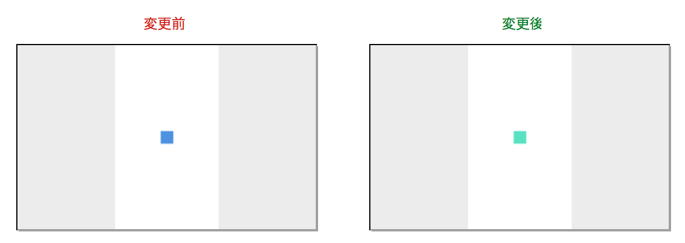
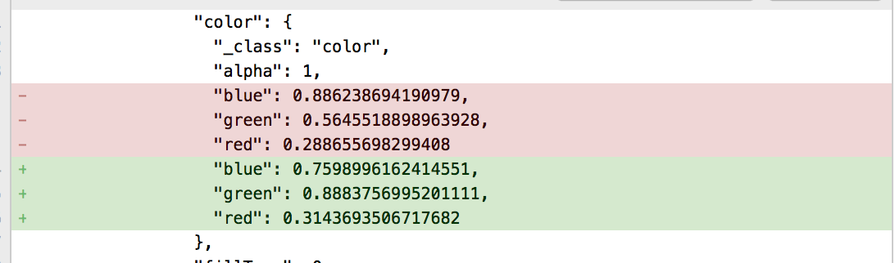

# sketch-template

## 便利にしてくれること
### 1. 画像ファイル自動生成
- `.sketch`ファイルを監視し、保存タイミングでExport(slice)設定された画像を自動で書き出します
- svgoで自動的にsvgを圧縮します

### 2. JSON自動生成
[SketchTool](https://www.sketchapp.com/tool/)で生成したJSONと、.sketchをJSON化を同時に生成をします。

これにより、バイナリデータからテキストデータとなるため、Gitでデザインデータを視覚的に管理できるようになり、エンジニアとのコミュニケーションが円滑となるはずです。

### 色を変更した場合の例
#### プレビュー画像


#### コード


（色の指定方法はRGBのようだが詳細不明。。。）

## インストール
### 本リポジトリをクローン
```
git clone git@github.com:mdb-konno/sketch-template.git
```

### SketchTool
```
$ sudo /Applications/Sketch.app/Contents/Resources/sketchtool/install.sh
```

※事前にSketch.appのインストールが必要

### jq
```
$ brew install jq
```

※Homebrew(`brew`)をインストールしていない方は[こちら](https://brew.sh/index_ja.html)を参考にしてください


### npm package
```
npm i
```

## 使い方
- クローンしたフォルダ内で`npm start`
- その後、`template.sketch`ファイルで編集するだけ
- Watchingを止めたい時は、`⌃ + c`
- 画像書き出しだけ行いたい時は、`npm run build`

## フォルダ構成

| フォルダ名 | 説明 |
| ------------- | ------------- |
| dist | 書き出されたファイル（画像、json） |
| sh | シェルスクリプト格納場所 |
| Source Files | `.sketch`ファイル格納場所 |
| pakage.json | 設定やscripts変更時編集 |
| svgo_config.yaml  | svgo設定変更時編集 |


## カスタマイズ
### pakage.json
以下`fileName`はお好みで変更してください。
`.sketch`ファイル名と同じにしておく必要があります。
また、`path_dist`をGitフォルダに指定すると管理が楽になると思います。

```json
  "config": {
    "fileName": "template",
    "path_dist": "dist"
  },
```

### svgo_config.yaml
お好みで圧縮設定してください。

[svgo(公式)](https://github.com/svg/svgo)
